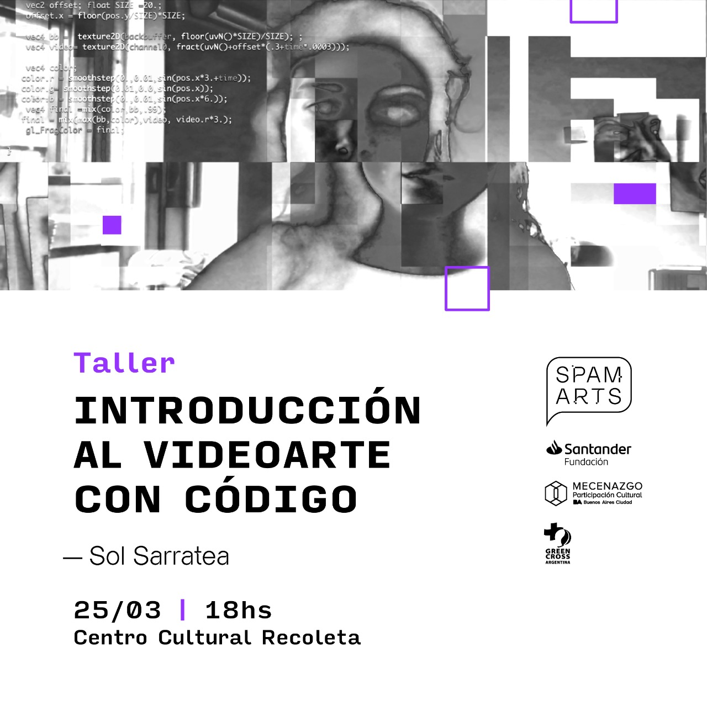

# SPAM ARTS - DEMO

Código fuente de herramienta web para la edición de video en tiempo real. [Acceder aquí para usarla](https://spamarts-demo.solsarratea.world/)

**Es una versión simplificada de la gran herramienta creada por Max Bittker 's  [shaderbooth.com](shaderbooth.com)**

Este proyecto fue desarrollada para el **Taller: "Introducción al videoarte con código"** para el festival **SPAM ARTS**

 </img>

**Disclaimer**
Cualquier edición del shader no se guardará, por eso para customizar la herramienta recomiendo seguir las instruccions de la sección `desarrollo local`.

## Desarollo local 

Instalarse el administrador de paquetes [yarn](https://github.com/yarnpkg/berry)

1. Clonarse el repo  
2. Correr desde la terminal `yarn` y `yarn start`
3. Entrar `http://localhost:9966/`

Crear archivos(shaders) en la carpeta `demos/` para agregar efectos especiales.
